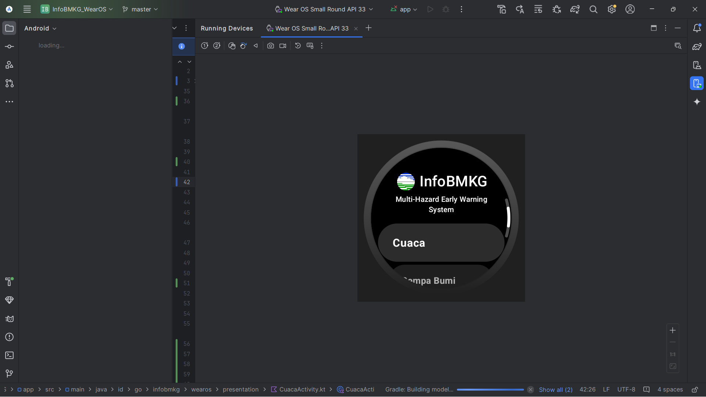
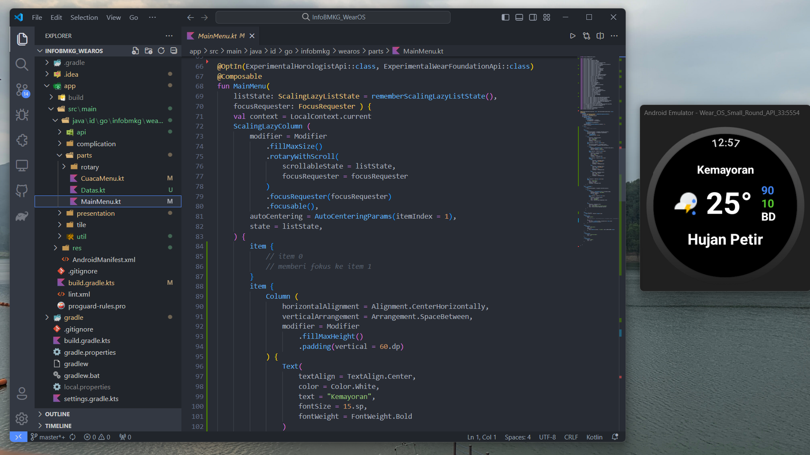

# Info BMKG for WearOS

## Overview
This is a wearable app based on [WearOS](https://wearos.google.com/). This project is unfinished. I only update when i have a free time. This app used to be my undergraduate thesis topic, but i changed my mind hwhw.

## Features
- Main Menu

- Present Weather

- Still under development :3

## Contributing
Just pull request if you have any updates. I'll check.

## License
This is a public license. Feel free to recode or maybe use it in your project. Don't forget to mention me hehe.